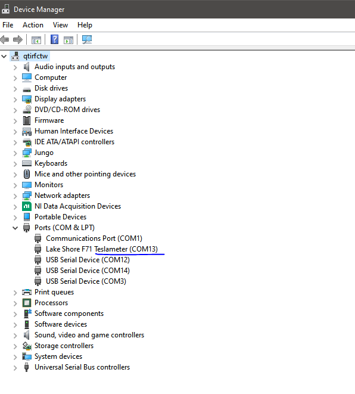

(Original code was created by https://github.com/milanliepelt)

Teslameter-live-plot.py uses the Teslameter class from the lakeshore module to collect magnetic field vector components and the magnitude and to plot them in real time.

The script requires installion of the device drivers.
Install their driver ZIP from here https://www.lakeshore.com/resources/software . Unpack the ZIP file in the Download folder. Go to Windows device manager, search for new Hardware, click the unknown hardware and update / install new drivers. Select the folder with the unpacked content from the ZIP File, and install it.


When you run the script, it will ask to type the com port of the device. On Windows, you can look it up in the device manager



## Running the program from the terminal

You can run the script directly from the terminal using

    python Teslameter-live-plot.py

You might also need to install the required packages suing
    
    python3 -m venv .venv
    pip install -r requirements.txt

## Creating a .exe file

Alternatively, You can also create an executable file: 

1. Install pyinstaller by running the command **`pip install pyinstaller`** in your command prompt or terminal.  
2. Navigate to the directory where your Python code is located using the command prompt or terminal.
3. To create a single executable file, run the command
    
    ```
    pyinstaller --onefile Teslameter-live-plot.py
    ```
    
4. This will create a new folder called "dist" in the same directory as your Python file. Inside this folder, you will find your executable file.
5. You can now move the executable to a different location and run it without needing to have Python installed on the computer.
